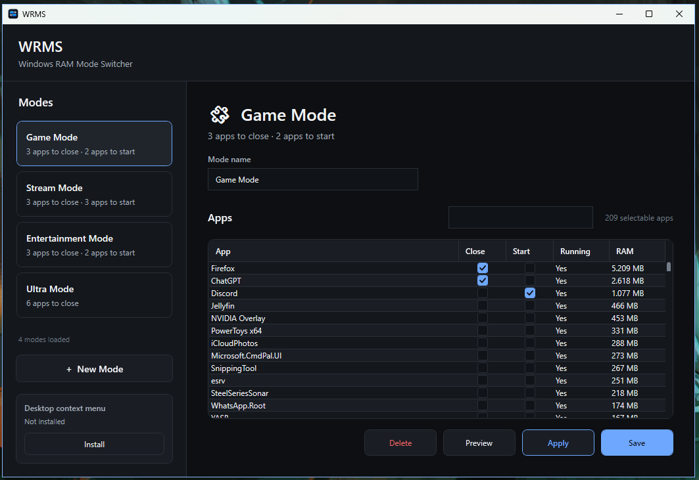
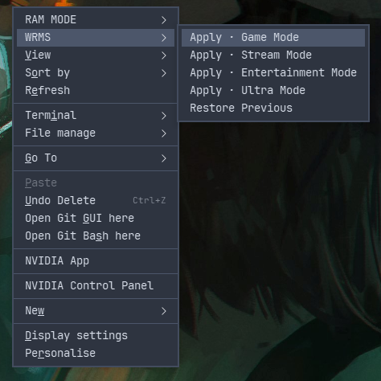
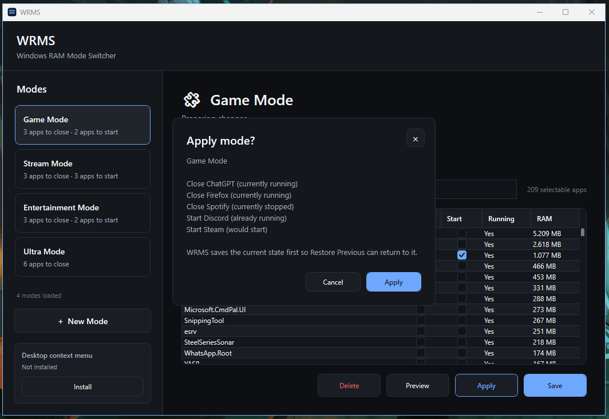

# WRMS

**Windows RAM Mode Switcher**

A lightweight Windows mode switcher for starting and closing the apps you want for different setups.

Create your own modes, choose exactly what should close or start, preview the changes, and apply them when you're ready.

**WRMS is a mode switcher, not an optimizer.**

It doesn't try to guess which Windows processes are "unnecessary", kill random services or promise more FPS. It simply automates app switching that you would otherwise do yourself.

**[Download v0.1.0](https://github.com/rockyroos/wrms-releases/releases/tag/v0.1.0)** · [Installation instructions](#install-with-powershell)



*Example modes from a configured installation. A fresh WRMS installation starts with no saved modes.*

## Why I built WRMS

WRMS started as a small personal setup.

Whenever I wanted to game, stream or just use my PC for something different, I would manually close apps I wasn't using, including things still running in the background. Not because Windows needed some magical cleanup, but simply because I didn't need everything sitting in memory at the same time.

After doing that enough times, I wanted a button for it.

So I started building my own little mode switcher with PowerShell and Nilesoft Shell. I had modes like **Game Mode**, **Stream Mode**, **Entertainment Mode** and **Ultra Mode**. Each one could close the apps I didn't need and start the ones I did.

It was basically automating something I was already doing by hand.

That little personal setup eventually turned into WRMS: a configurable mode switcher where you decide what happens.

No automatic optimization and no mystery tweaks. Just your apps, your modes and an easy way to switch between them.



## What WRMS does

A mode can contain apps to **close**, apps to **start**, or both.

Before anything changes, WRMS can show you exactly what the mode is about to do. When you apply it, the current state is saved so you can use **Restore Previous** afterwards.

Modes can be managed from the WRMS configurator and launched from the Windows desktop context menu. Nilesoft Shell integration is also available.

## How it works

1. Create a mode.
2. Choose which apps should close and which should start.
3. Preview the mode to see what WRMS is about to do.
4. Apply it when you're ready.
5. Use **Restore Previous** if you want to return to the app state from before the switch.

WRMS only acts on the apps you choose. RAM usage is shown as information, not as a target for automatic cleanup.

## Features

- Create your own Windows modes
- Choose apps to close and start per mode
- See whether an app is currently running
- View RAM usage without treating RAM as something that needs to be "cleaned"
- Preview changes before applying them
- Save the current app state before a mode is applied
- Restore the previous app state
- Launch modes from the Windows desktop context menu
- Optional Nilesoft Shell integration
- Lightweight WPF configurator
- PowerShell mode engine
- No tray app, background service or always-running process



## Download v0.1.0

**[Open the v0.1.0 release and its downloads](https://github.com/rockyroos/wrms-releases/releases/tag/v0.1.0)**

| ZIP | What you need separately |
| --- | --- |
| [Self-contained](https://github.com/rockyroos/wrms-releases/releases/download/v0.1.0/WRMS-v0.1.0-win-x64-selfcontained.zip) | PowerShell 7; .NET is included |
| [Standard](https://github.com/rockyroos/wrms-releases/releases/download/v0.1.0/WRMS-v0.1.0-win-x64.zip) | PowerShell 7 and .NET 8 Windows Desktop Runtime (x64) |

Both builds require Windows x64. Choose **self-contained** if you are unsure whether the .NET runtime is installed. PowerShell 7 is required for both; self-contained does not include PowerShell.

Use the named WRMS ZIPs under **Assets**. GitHub's automatic **Source code (zip/tar.gz)** downloads contain this documentation repository and are not installable WRMS packages.

## Install with PowerShell

### 1. Install PowerShell 7 if needed

In Windows Terminal or Windows PowerShell, run:

```powershell
winget install --id Microsoft.PowerShell --exact --source winget
```

Close and reopen your terminal, then open **PowerShell 7**. Check with `$PSVersionTable.PSVersion`: the major version must be 7 or newer. `pwsh` must be available on PATH.

Microsoft also provides [PowerShell installation instructions](https://learn.microsoft.com/en-us/powershell/scripting/install/install-powershell-on-windows). For the standard ZIP, install the **Windows Desktop Runtime, x64, .NET 8** from [Microsoft's .NET 8 download page](https://dotnet.microsoft.com/en-us/download/dotnet/8.0). The SDK and ASP.NET runtime are not substitutes for the Windows Desktop Runtime.

### 2. Paste this complete block into PowerShell 7

This downloads the self-contained ZIP, verifies its SHA-256 hash, extracts it into a new temporary folder, and installs WRMS into `%LOCALAPPDATA%\WRMS`. No manual ZIP download or extraction is needed for this route. The WRMS installation itself does not need administrator rights.

```powershell
$ErrorActionPreference = 'Stop'
if ($PSVersionTable.PSVersion.Major -lt 7) { throw 'Open PowerShell 7 first.' }
$asset = 'WRMS-v0.1.0-win-x64-selfcontained.zip'
$expected = '268D71789F82858D1EDBD47D7AA9F85AE971AB6120A62FAEC89906973E374259'
$work = Join-Path ([IO.Path]::GetTempPath()) ('WRMS-' + [guid]::NewGuid().ToString('N'))
New-Item -ItemType Directory -Path $work | Out-Null
$zip = Join-Path $work $asset
Invoke-WebRequest -Uri "https://github.com/rockyroos/wrms-releases/releases/download/v0.1.0/$asset" -OutFile $zip
if ((Get-FileHash -LiteralPath $zip -Algorithm SHA256).Hash -ne $expected) { throw 'Download checksum mismatch. Installation stopped.' }
Unblock-File -LiteralPath $zip
$unpacked = Join-Path $work 'package'
Expand-Archive -LiteralPath $zip -DestinationPath $unpacked
& (Join-Path $unpacked 'Install-WRMS.ps1') -SourcePath $unpacked
```

The destination must be empty. If you already have WRMS installed, the installer stops without replacing it. To test v0.1.0 alongside it, add `-InstallPath "$env:LOCALAPPDATA\WRMS-v0.1.0"` to the last line. This version does not migrate existing profiles automatically.

Then launch WRMS:

```powershell
& "$env:LOCALAPPDATA\WRMS\WRMS.Configurator.exe"
```

Adjust the launch path if you selected a different installation folder. The temporary download and extracted package can be removed after installation.

## Alternative: download and extract yourself

1. Download either named WRMS ZIP from the release's **Assets** section.
2. Compare `Get-FileHash -Algorithm SHA256 -LiteralPath 'C:\path\to\your-download.zip'` with the matching line in the release's `SHA256SUMS.txt`.
3. After the hash matches, right-click the ZIP, select **Properties**, and select **Unblock** if shown. Extract all files into a new folder.
4. Open PowerShell 7 in that extracted folder and run:

```powershell
.\Install-WRMS.ps1 -SourcePath .
```

That command installs an **already extracted** package; it does not download WRMS. The full block above performs all three steps: download, extract, install. There is no WRMS WinGet package in this release.

If scripts are blocked, check `Get-ExecutionPolicy -List`. On a personally managed PC, you can permit local/unblocked scripts for just the current PowerShell window with `Set-ExecutionPolicy -Scope Process RemoteSigned`, then retry. Organization policy may prevent this; ask your administrator rather than changing machine-wide policy.

## First use

1. Open `WRMS.Configurator.exe` from the installed folder.
2. Create a mode and select the apps you want to close or start.
3. Save the mode and preview its actions.
4. Save work in the apps you selected before applying the mode.
5. Use **Restore Previous** to restore the saved app running state where possible. This does not recover unsaved documents, tabs, or full application sessions.

Desktop context-menu integration is optional and can be installed or removed from the configurator. Optional Nilesoft integration is included under `integrations\nilesoft`; Nilesoft Shell itself is not bundled.

Modes and local app paths are stored in the installation's `config` folder; session state and logs are stored in `state` and `logs`. These are personal files: review them before attaching them to a public issue.

To remove WRMS, first remove its context-menu integrations if enabled, close the configurator, and delete its installation folder. Back up `config` first if you want to retain your modes.

## About this repository

This repository distributes official releases and installation documentation. Development history, personal profiles, test data, and C# project sources are not included here. Release ZIPs include the readable PowerShell engine and integration scripts required to run WRMS.

v0.1.0 is an early release. The executable and scripts are not code-signed; Windows may display an unknown-publisher warning. Checksums identify these exact downloads, but are not publisher signatures.

Report problems through [Issues](https://github.com/rockyroos/wrms-releases/issues), including your Windows version, build choice, and error text. Remove personal information before posting.

## License

Copyright © 2026 Rocky Roos. WRMS is proprietary software. Official releases may be used for personal, non-commercial purposes, including running their bundled WRMS scripts. Commercial or organizational use requires permission. See [LICENSE](LICENSE).

Commercial licensing, partnerships, or custom development: **di5104kfy@mozmail.com**.

Third-party components retain their own licenses. See [THIRD-PARTY-NOTICES.txt](THIRD-PARTY-NOTICES.txt) and the license files bundled with the self-contained ZIP.
